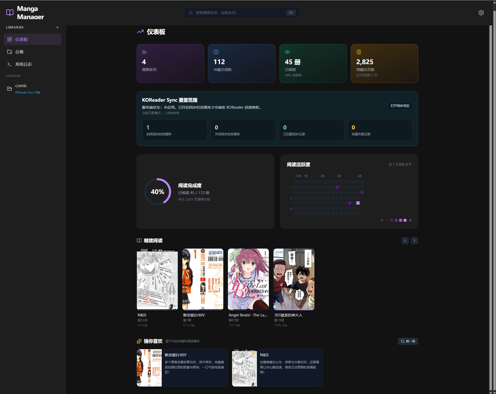
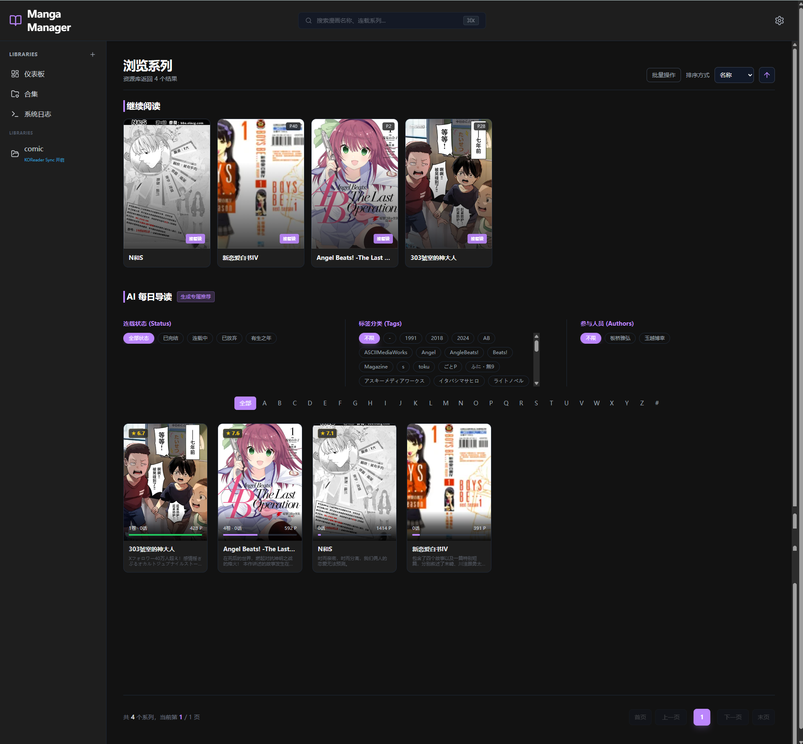
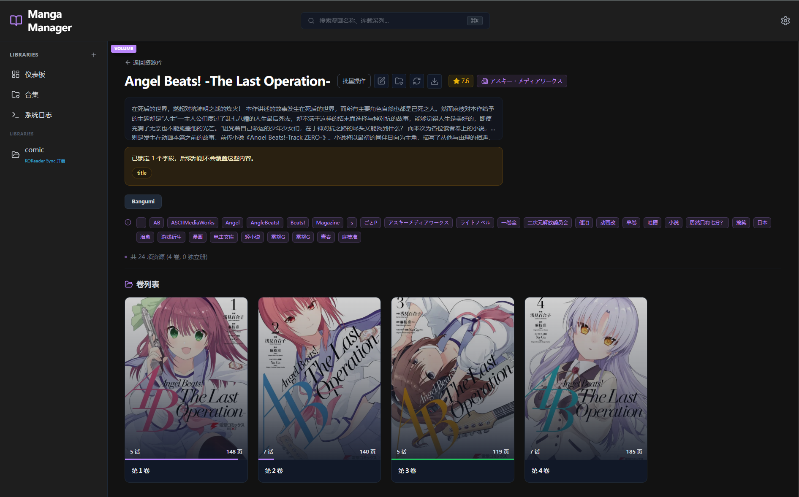
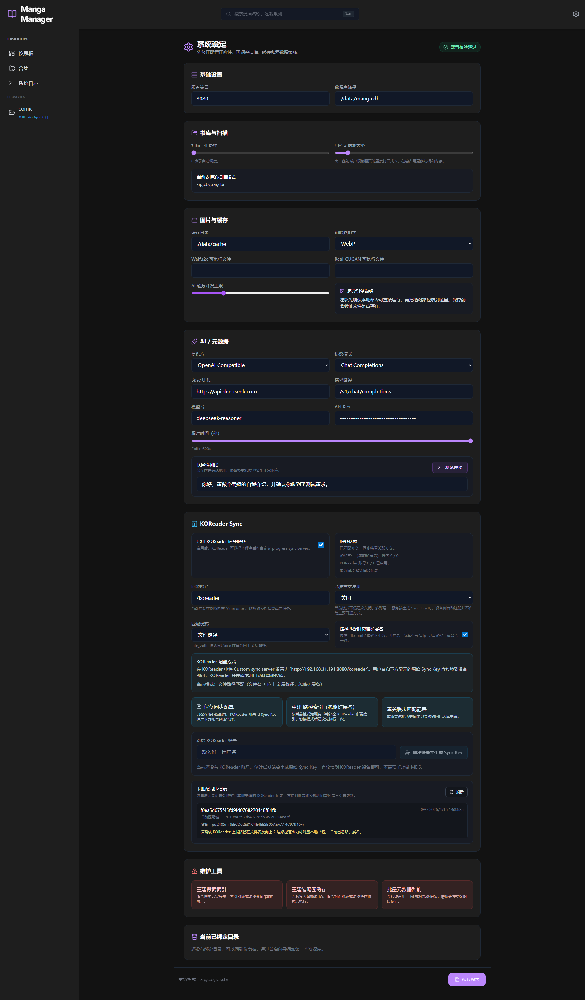

# Manga Manager 📚✨

Manga Manager 是一款使用现代全栈技术打造的高性能、多端自适应**本地个人漫画/画集管理软路由服务器**与**沉浸式的阅读器**。

本系统采用 `Go` + `React (Vite+TailwindCSS)` 构建，剥离了传统的云端数据库依赖，完全基于本地文件扫描。不论您有多少深藏于硬盘的卷册，它都能一举把您的收藏转变为具备私人专属 API 的数字阅读宇宙。不仅支持快速检阅与管理，我们还率先引进了 **Waifu2x / Real-CUGAN 次世代超分辨重建引擎**，即便在最残暴的网络带宽或最久远模糊的画质下，也能让每一页都呈现极致画卷。

---

## 🖼️ 截图预览

以下截图按“总览 -> 书库 -> 系列 -> 阅读 -> 运维配置”的主线组织，方便快速理解系统的核心能力与日常使用路径。

### 1. 仪表板总览

- 仪表板把馆藏规模、阅读活跃度、最近阅读和后台任务集中到一个入口，是理解系统全貌的第一张图。



### 2. 资源库浏览

- 资源库页面展示系列网格、筛选与排序能力，以及每个系列当前的阅读进度与封面状态。



### 3. 系列详情与元数据

- 系列详情页聚合卷册、元数据、阅读进度和运维动作，体现“系列维度管理”而不只是文件浏览。



### 4. 移动端阅读器

- 阅读器支持移动端沉浸式阅读，这张图重点展示跨端可用性以及阅读界面的完成度。


### 5. 系统设定与运维能力

- 设置页和同步配置页展示了系统面向长期运行的另一面：配置校验、KOReader 同步和维护工具。



---

## 🌟 核心特性 (Features)

### 🗃️ 极速本地扫描与内建数据库
- 基于 Golang 的高性能协程调度 (`Goroutine Worker Pool`)，充分榨取多核 CPU 并发读取、解析画册元数据。
- 采用零配置的嵌入式 `SQLite (CGO-free)` 作为索引库，解压即用，绝不会污染您的系统环境。
- 可选压缩编码 (`WebP / AVIF`) 按比例智能截取卷宗封面缓存，告别千篇一律的图标痛点。

### 🔮 画质重建：次世代超分辨率 AI 支持
- **Waifu2x**：深度定制支持动漫风格的 `waifu2x-ncnn-vulkan` 算法。
- **Real-CUGAN**：集成当前备受瞩目的同生态 `realcugan-ncnn-vulkan` 超清重建。
- 当阅读古早画集或面临压缩伪影时，前台均可实时向后端下达指令。无论是**多级放大**、**动态降噪控制**、甚至是末端的**轻度重编码传输 (WebP直出)**，一切复杂参数只受您指尖支配。系统已完美实现这两大引擎的环境隔离与热驱重置！

### 🤖 LLM 本地大模型智能刮削
- 支持与第三方推理后端接口对齐（如 `Ollama`），并开放全动态 `Endpoint/Model` 参数设置。
- 自动捕捉提取画册根目录，智能阅读长图内容乃至利用视觉大模型（Vision）梳理由来、标签和简介，形成优美的独立元数据持久化落盘，再也无需人工苦力录入资料。

### 📱 响应式多模态沉浸阅读
- 移动端 `Mobile First` 的 TailwindCSS 断点级优化设计：汉堡抽屉侧栏、安全边距自适应，从电脑大屏至手机掌中宝皆保持最优排布。
- **画轴流瀑布流 (Webtoon)** / **沉浸仿真翻页 (Paged)** 多模式无缝热切。
- 支持 `LTR/RTL` 翻页反转，无论欧美漫或日漫皆得心应手。
- 提供“原始、等宽、等高、**适屏（全边界无死角填满拉伸）**”四档画幅调度，搭配智能页面预加载防抖击穿算法 (Preloader)，秒切如翻飞真书一般顺滑。

### ⚙️ 后端级工业稳定性
- 新构建的 `slog + Lumberjack` 底层双路多态日志管线：所有关键请求或崩溃（如内存暴雷）都将带有结构化字典特征录入 `data/*.log`。
- 在此之上引入了强制尺寸截断与 `gzip` 无感时间戳翻滚压缩！
- **可视化日志看板 (!新增)**：最新版本中集成了能够实时调取并高亮显示 `error / warn / info` 的系统日志专用页面，您无需登录服务器即可掌控后端全时段运行脉络。

### 🎨 高端体验细节
- **独立随动侧边栏 (!新增)**：我们在最新的布局迭代中重构了 `100vh` 响应式视口框架。当您沉浸在滚动的茫茫书海或者成百上千条日志数据时，左侧核心导航栏依旧如影随形贴合视野。

---

## 📦 如何部署与使用 (Installation & Usage)

得益于 Golang 强悍的交叉编译机制，Manga Manager 不需要被困于环境依赖地狱。无论您是 Windows / Linux 还是 Mac ARM，我们都已备好了绿色整合包：

### 1. 一键全平台联编
在项目根目录运行预编译构建脚本（需具备 `Node.js` 与 `Go` 环境）：
```bash
# 执行后，将先利用 vite 为您的前端打包压缩到 dist 目录，
# 紧接着执行交叉编译为 Mac ARM, Linux AMD64 和 Windows 三端输出完整的二进制底座。
./build.sh
```

### 2. 执行二进制文件
在当前目录将浮现专属于您操作系统的执行程序。假设您处于 macOS 上：
```bash
./manga-manager-mac-arm64
```
系统将自动生成 `data/` 目录用于安全落盘缩略图、数据库、应用配置及日志流水。

### 3. 打开控制台
启动成功后，浏览器访问：
[http://localhost:8080](http://localhost:8080)
进入**设置齿轮 ⚙️**，添加包含您漫画文件群的绝对目录并执行**全局资源扫描**即可！

---

## 🛠️ 关于超分辨率重构算力的开启
如果您期待体验无损放大的快感：
1. 请自行前往 GitHub 分别下载 `waifu2x-ncnn-vulkan` 或 `realcugan-ncnn-vulkan` 的官方 Release 跨平台压缩包并解压至本地。
2. 前往 Manga Manager **设置 -> 智能扫描与处理引擎设定** 中，将两个执行程序（例如 `*.exe`）的**绝对路径**对应填入各自的框并保存。
3. 返回任何一本画集开始阅读并在右上角启动对应滤镜即可享用！

---
*Developed with ❤️ via AI-Pair.*
